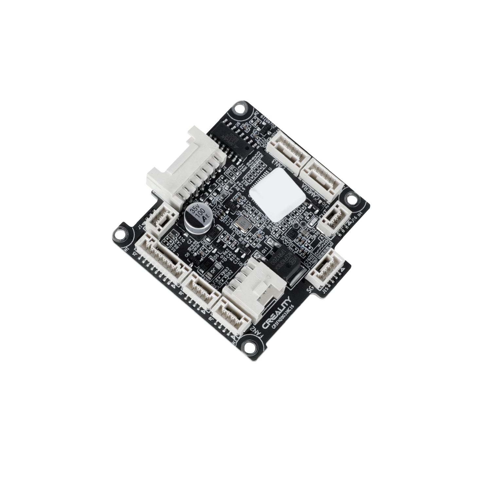
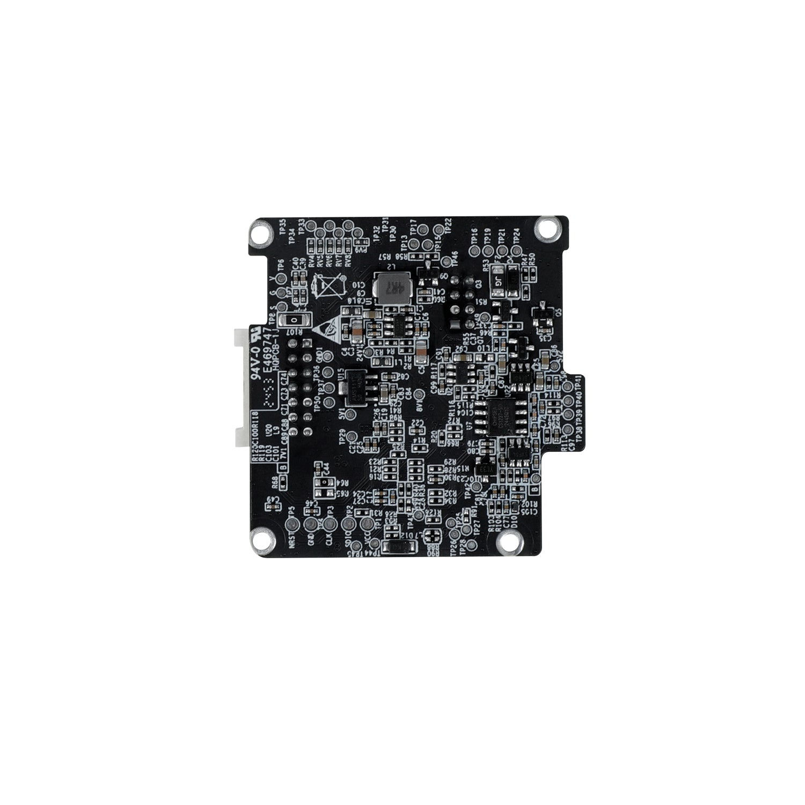

# CR1FN200338 C16: photos

> **Disclaimer.** Product photos only. No pin data exists for C16; the
> [C15 pin map](../C15/) is the nearest, and pins may have changed between
> revisions.

Photos: Creality store, "K2/K2 Pro/K2 Plus Toolhead Board".

## Read from the photos

- Silkscreen **`CR1FN200338C16`** beside the Creality logo, bottom edge of the
  front. **[verified]** at 5x zoom on the 1500 px image, and consistent with the
  `CR1FN200338C15` the configs name.
- Labelled connectors on the front include **CAMERA**, **FAN2** and **FAN3**.
  Other labels are too small to read at this resolution.
- A large white multi-way connector and a second, 2-row white connector.
  **[inferred]** One is the cable to the mainboard, and one or both carry the
  ribbons to the extruder motor board.
- One electrolytic capacitor (35 V, 100 uF).
- The back is populated too: small-signal parts and several ICs, but no
  connectors.
