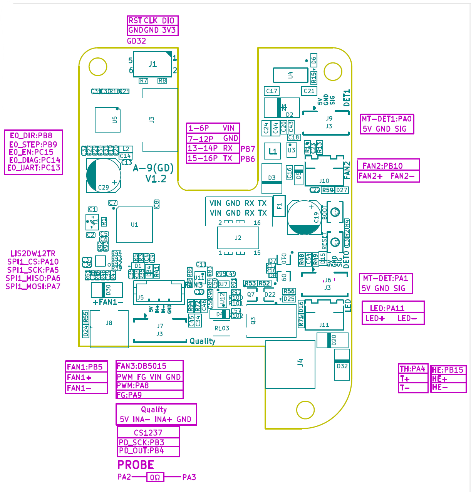

# A-9(GD) V1.2: QIDI pin sheet

> **Disclaimer.** This is QIDI's sheet for **V1.2**. The Max4 ships with V1.5,
> and the hotend fan and temperature sensing are known to have changed since
> (see [V1.5](../V1.5/)). Everything on this page is **[vendor]** unless
> tagged otherwise.

## Transcription

### Connectors

| Ref | Label | Pins | MCU |
|---|---|---|---|
| J1 | (unlabelled, 2x3) | 1 DIO, 2 3V3, 3 CLK, 4 GND, 5 RST, 6 GND | SWD, see below |
| J2 | cable, 16-pin | 1-6 VIN, 7-12 GND, 13-14 RX, 15-16 TX | RX **PB7**, TX **PB6** |
| J3 (top) | extruder motor | 4-pin | via U5 TMC2209 |
| J4 | heater | HE+ / HE- | **PB15** |
| TH | thermistor | T+ / T- | **PA4** |
| J6 | DET0 | 5V / GND / SIG | MT-DET **PA1** |
| J7 | Quality | 5V / INA- / INA+ / GND | load-cell bridge into CS1237 |
| J8 | FAN1 | FAN1+ / FAN1- | **PB5** |
| J9 | DET1 | 5V / GND / SIG | MT-DET1 **PA0** |
| J10 | FAN2 | FAN2+ / FAN2- | **PB10** |
| J11 | LED | LED+ / LED- | **PA11** |
| J5 | FAN3 (DB5015 blower) | PWM / FG / VIN / GND | PWM **PA8**, FG **PA9** |
| S1 / S2 | RESET / BOOT | buttons | |

### On-board devices

| Device | Signals |
|---|---|
| U5 TMC2209, extruder | DIR PB8, STEP PB9, EN PC15, DIAG PC14, UART PC13 |
| LIS2DW12TR | SPI1: CS PA10, SCK PA5, MISO PA6, MOSI PA7 |
| CS1237 | PD_SCK PB3, PD_OUT PB4 |
| PROBE | PA2 joined to PA3 through a 0 ohm link |

### J1

Labelled "GD32" on the sheet, with RST / CLK / DIO / 3V3 / GND. That is the
standard ARM **Serial Wire Debug** set: the MCU's programming and debug port.
It is **not** a motor or closed-loop interface: there is no VIN on it.

- **[inferred]** CLK and DIO go to PA14 (SWCLK) and PA13 (SWDIO), the fixed SWD
  pins on this MCU family.
- **[inferred]** It is unpopulated on production boards because the factory
  flashes through it with pogo pins. The V1.5 product photo shows a header
  fitted; at least one owner's board has none.
