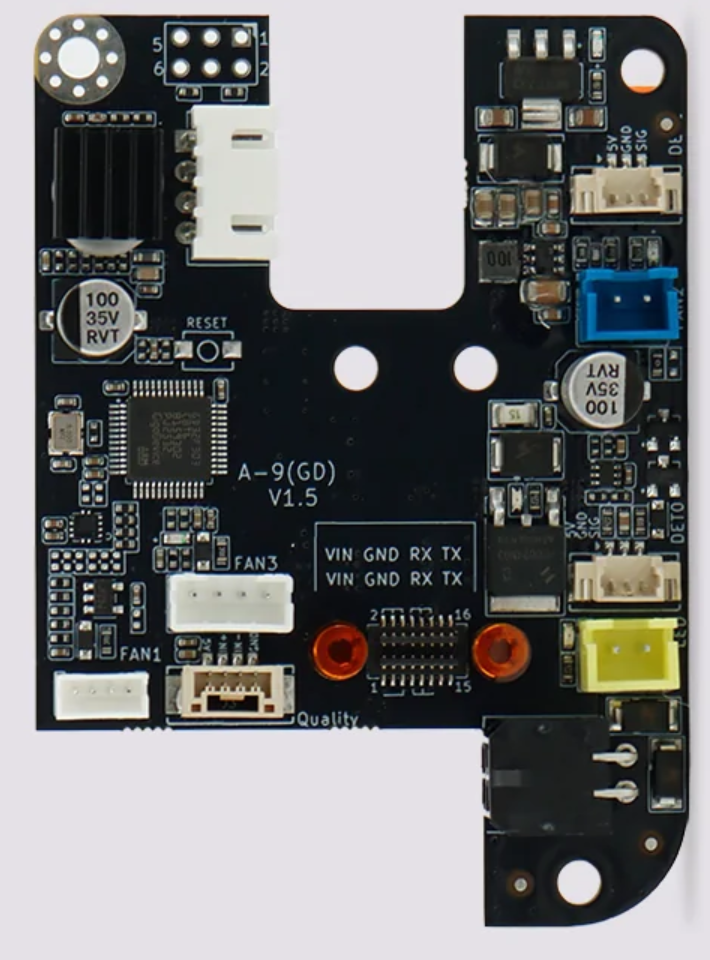

# A-9(GD) V1.5: the shipping Max4 board

> **Disclaimer.** There is no QIDI pin sheet for V1.5. This page combines the
> [V1.2 sheet](../V1.2/) with one owner's live Klipper config. The config shows
> which pins the firmware *uses*; it does not prove which connector each pin
> reaches. Continuity-test before you rely on anything here.

Photo: QIDI product page, Max4 Adapter Plate (SKU MAX4017).

## Pin map

**[verified]** entries are from the live `printer.cfg` and its includes on a
Max4 running firmware 02.02.01.08, read over SSH on 2026-09-23. The V1.2 column
shows whether QIDI's older sheet agrees.

| Function | MCU pin | Klipper section | V1.2 sheet |
|---|---|---|---|
| Extruder STEP | PB9 | `[extruder]` | agrees |
| Extruder DIR | PB8 | `[extruder]` | agrees |
| Extruder ENABLE | !PC15 | `[extruder]` | agrees |
| TMC2209 UART | PC13 | `[tmc2209 extruder]` | agrees |
| Heater | PB15 | `[extruder]` | agrees |
| **Hotend temperature** | **MAX6675, CS PB12, hardware SPI2 at 2 MHz** | `[extruder]` | **differs**: V1.2 has a thermistor on PA4 |
| **Hotend fan** | **PA15**, tachometer **PB5** (2 ppr) | `[heater_fan hotend_fan]` | **differs**: V1.2 has the fan on PB5 |
| Part-cooling blower | PWM PA8, tach PA9 | `[fan_generic cooling_fan]` | agrees |
| Accelerometer | CS PA10, SCK PA5, MOSI PA7, MISO PA6 (software SPI) | `[lis2dw]` | same pins; V1.2 lists them as hardware SPI1 |
| Load cell (CS1237) | SCK PB3, DOUT PB4 | `[probe_air]` | agrees |
| Filament sensor (DET1) | !PA0 | `[filament_switch_sensor]` in an included macro file | agrees |
| Host UART | TX PB6, RX PB7 | `[mcu THR]`, 500000 baud | agrees |

## Differences from V1.2

1. **Hotend fan.** V1.2 drives a 2-pin FAN1 from PB5. V1.5 drives the fan from
   **PA15** and uses **PB5 as a tachometer input**. PA15 does not appear on the
   V1.2 sheet. **[inferred]** from the photo: FAN1 now has more than two pins,
   consistent with an added tach line.
2. **Hotend temperature.** V1.2 reads a thermistor on PA4. V1.5 reads a
   **K-type thermocouple through a MAX6675** on SPI2 (CS PB12; PB13 and PB14
   are the SPI2 clock and data pins). **[inferred]** The T+/T- connector now
   carries thermocouple leads to an on-board MAX6675.
3. **Accelerometer bus.** Same pins, driven as software SPI rather than the
   SPI1 peripheral. That is a configuration choice, not a hardware change.

The two hardware changes are both at the hotend. The rest of the V1.2 sheet
agrees wherever it can be checked, which is some evidence it is still right
elsewhere, but not proof.

## Spare I/O

Pins on the V1.2 sheet that nothing in the live config references:

| Pin | Where | Suitable for |
|---|---|---|
| **PA1** | DET0 connector (J6), with 5V and GND | Best spare: a direct MCU pin on a connector. Built as an input, so check for a pull-up or series resistor before driving it as an output |
| PB10 | FAN2 (J10) | Load switching only; it drives a MOSFET, not a logic line |
| PA11 | LED (J11) | Load switching only; it drives a MOSFET |
| PC14 | TMC2209 DIAG | Hard-wired to the driver |
| PA4 | V1.2 thermistor input | May no longer reach a connector on V1.5 |
| PA13 / PA14 | J1 (SWD) | Only usable as GPIO with custom firmware |
| PA2 / PA3 | 0 ohm "PROBE" link | **Treat as in use.** QIDI's compiled probe drivers (`air.so`, `cs1237.so`) may use these without them appearing in any `.cfg` |

**[inferred]** None of these has been continuity-tested on a V1.5 board.

## Driving an external extruder driver

STEP (PB9), DIR (PB8) and EN (PC15) already run to U5's pads. With the TMC2209
removed, those pads carry exactly the signals an external step/dir driver
needs, and no firmware change is required. Two consequences:

- Klipper will not start until `[tmc2209 extruder]` is deleted, because it
  queries the driver over PC13 at startup.
- PC13 (UART) and PC14 (DIAG) are left floating, which is harmless while
  nothing reads them.

## J1 (SWD)

See [V1.2](../V1.2/#j1). An ST-Link or J-Link on J1 can back up the THR
firmware, unless QIDI enabled read-out protection, and flash new firmware.
Replacing QIDI's firmware loses their CS1237 load-cell probe support unless
that is reproduced, and the load cell is the Z probe. **Back up before you
flash anything.** Some ST tools refuse non-ST chips, so a GD32 may need
J-Link, OpenOCD, or GigaDevice's own tools.
